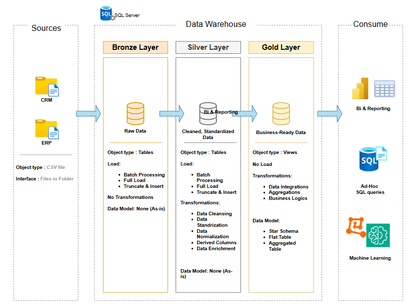

# SQL Data Warehouse and Analytics Project

## Overview
Welcome to the **Data Warehouse and Analytics Project**! 🚀  
This project demonstrates a complete data warehousing solution, from building a data warehouse to generating actionable business insights. Designed as a portfolio project, it highlights **industry best practices in Data Engineering and Analytics**.

The main goal is to consolidate sales data from multiple sources, create a business-ready data model, and enable analytical queries for reporting and decision-making.

---

## Data Architecture

The project follows the **Medallion Architecture** with three layers:

- **Bronze Layer**: Stores raw data as-is from source systems (CSV files).  
- **Silver Layer**: Cleanses, standardizes, and normalizes data for analysis.  
- **Gold Layer**: Houses business-ready tables using a **Star Schema**, including fact and dimension tables optimized for analytics.

### Project Structure



*Figure 1: Structure of the SQL Data Warehouse project showing Bronze, Silver, and Gold layers.*

---

## ETL Pipeline

The ETL process is divided into three main stages:

1. **Extract**: Load raw data from ERP and CRM CSV files.  
2. **Transform**: Clean, standardize, and combine datasets.  
3. **Load**: Populate the **Gold layer** with fact and dimension tables for analysis.

---

## Data Modeling

- **Dimension Tables**:
  - `dim_customers` – Customer descriptive information.
  - `dim_products` – Product descriptive information.

- **Fact Tables**:
  - `fact_sales` – Stores transactional sales events.

This model allows analysis of:

- Customer behavior and segmentation
- Product performance
- Sales trends over time


---

## Tools & Technologies

- **SQL Server / T-SQL**
- **SQL Server Management Studio (SSMS)**
- **Draw.io** – For architecture, flow, and model diagrams
- **Notion** – Project organization and task management
- **Git & GitHub** – Version control and collaboration

---

## How to Run the Project

1. Clone the repository:

```bash
git clone https://github.com/firdawss-Elhaddouchi/sql-data-warehouse-project.git
```

## Acknowledgements

This project was inspired by the tutorial and resources provided by [Baraa Khatib Salkini](https://www.youtube.com/@DataWithBaraa). Some scripts and datasets were adapted from the original material.
